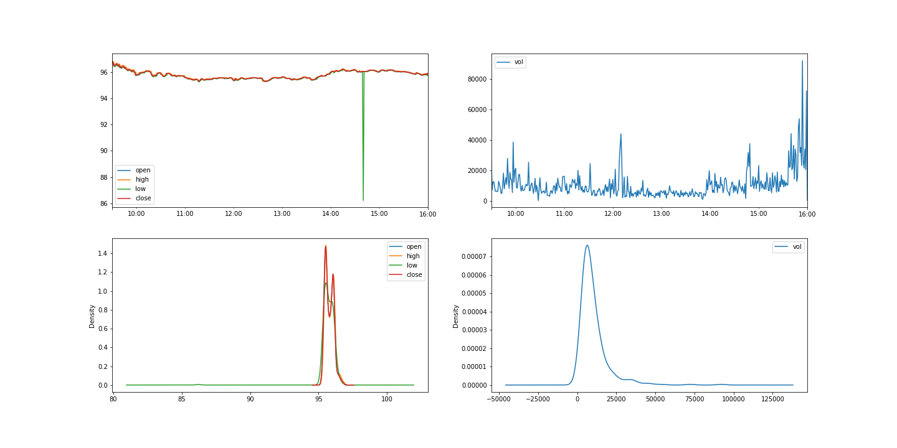
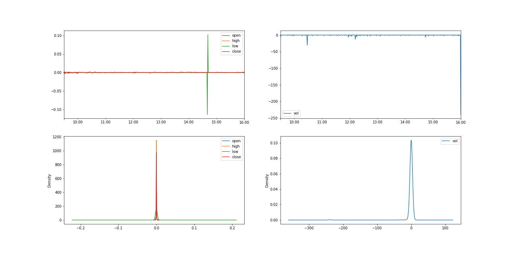
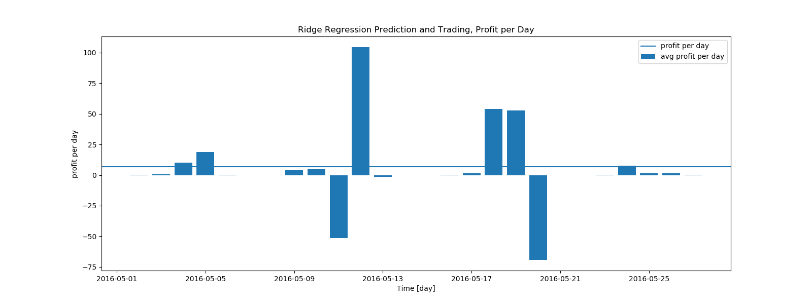
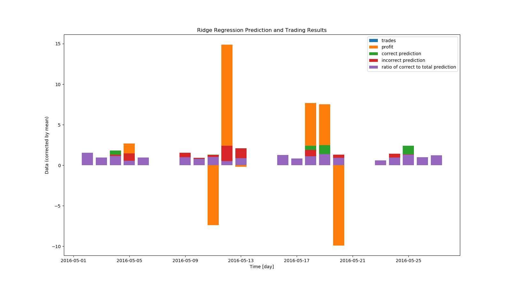
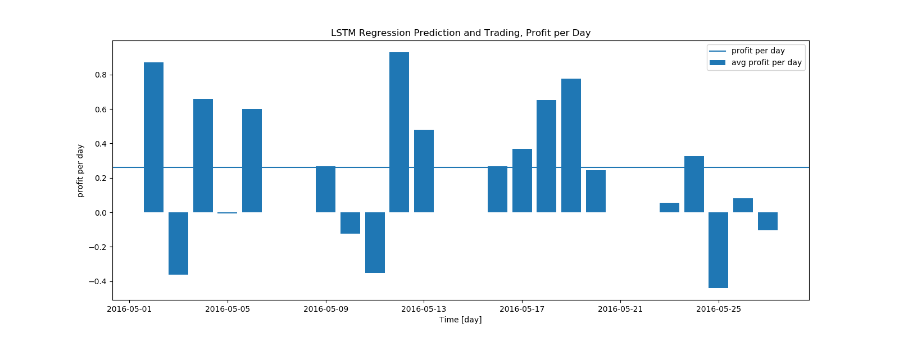
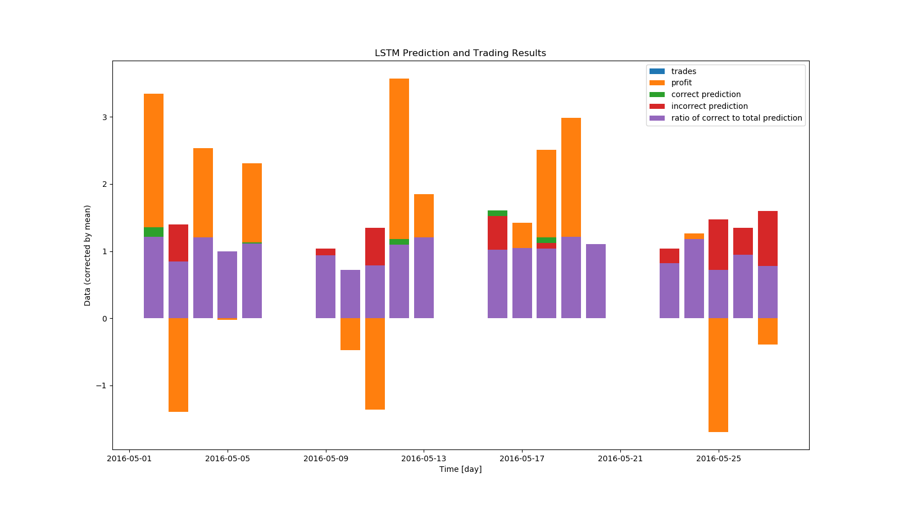
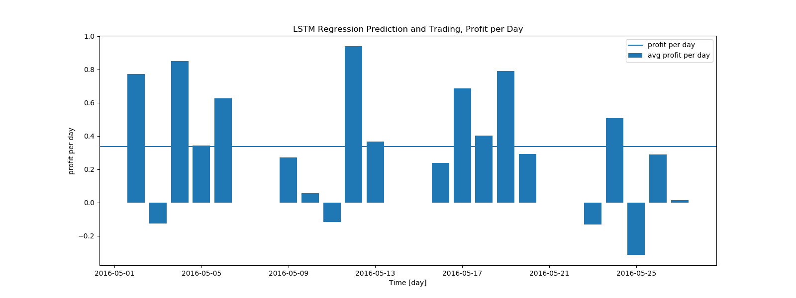
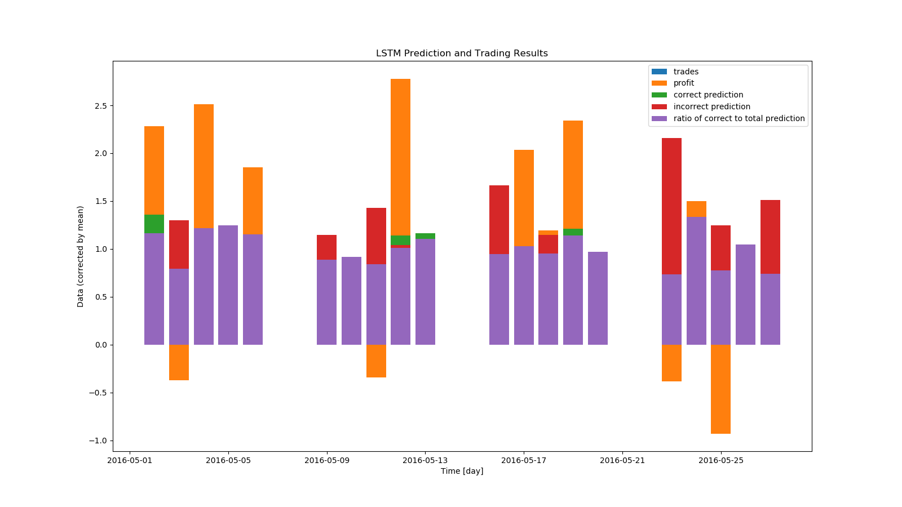
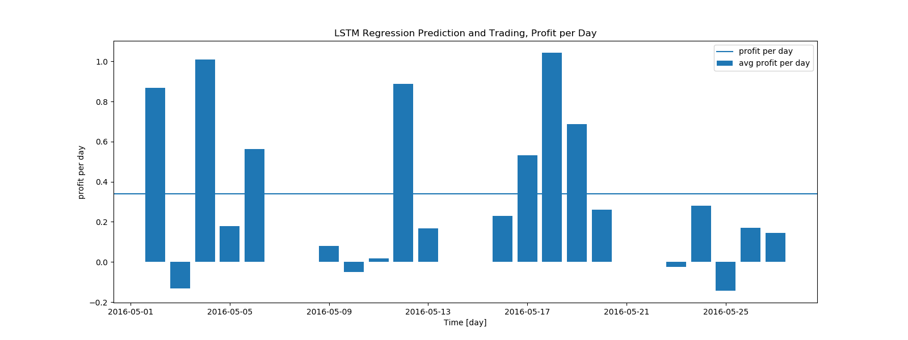
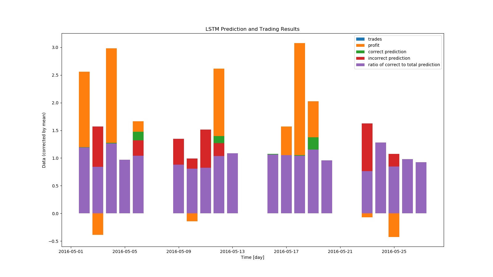

## Welcome to GitHub Pages

You can use the [editor on GitHub](https://github.com/brichardson36/ML-project-spring2020/edit/master/README.md) to maintain and preview the content for your website in Markdown files.

Whenever you commit to this repository, GitHub Pages will run [Jekyll](https://jekyllrb.com/) to rebuild the pages in your site, from the content in your Markdown files.

### Markdown

Markdown is a lightweight and easy-to-use syntax for styling your writing. It includes conventions for

```markdown
Syntax highlighted code block

# Header 1
## Header 2
### Header 3

- Bulleted
- List

1. Numbered
2. List


**Bold** and _Italic_ and `Code` text


[Link](url) and 
```

For more details see [GitHub Flavored Markdown](https://guides.github.com/features/mastering-markdown/).

# Introduction
The evolutionary arms race of stock trading continually drives the development of new machine learning methods. What we propose to do, is to take an artificial neural network known as an LSTM (Long Short-Term Memory) and use it in lieu of traditional trading models.
# Methods
## Stock Selection
The data chosen were the intraday Trade and Quote prices and volumes of MA (MasterCard) over the days of May 2016 (source: WRDS).
## Preprocessing
### Discretization
To allow for consistent forecasting, and to eliminate the impact of tiny discrepancies of time as a pure input, the data was binned into discrete buckets.
### Bucket Description
The buckets spanned from 9:30 AM to 4:00 PM, every business day. Each bucket was 1 minute long, and contained the opening, closing, high, and low price, as well as volume traded, for the bucket. The width of the buckets was minimized while ensuring every bucket had at least one data point.
### Feature Engineering
This process created a slew of features for models. The data need to be processed again, however. This stems from Stationarity. Stationary data has a constant mean and standard deviation over a given time period [sources needed] (reference pure_price_kde figures). Forecasting non stationary data is unreliable [sources needed]. To create Stationary data, the difference between a bucket’s parameters and the previous bucket’s parameters was calculated. This difference for a given bucket was calculated for all 5 previous buckets to create more features. The difference data was stationary (reference diff_in_price_kde figures) and thus suitable as a set of parameters for forecasting models.




### Normalizing
Data was normalized by subtracting the average of feature_n from each feature_n, and dividing the subsequent feature_n by the standard deviation of feature_n. This reduces scaling errors from features that have different units and scales. In this case, the scaling error between price and volume is reduced.
## Metrics
Models are successful if they return a higher percent profit over the time frame than comparable methods. To quantify this success, we chose two metrics: average profit per day and average ratio of correct purchases to total purchases per day.
# Models & Results
## Ridge Regression
### Reasoning
We assume that a price at time = n is related to a price at time = n+1, and that the differences in prices likewise reflect a dependent relationship. The parameters will suffer from multicollinearity. To tackle multicollinearity, ridge regression was proposed as a model. Ridge regression is a regression model built to account for multicollinearity. In ridge regression, a constant is added to all diagonal indices of the correlation matrix to improve variance.
### Model implementation
In the model used here, the constant to add was found using scikit-learn’s auto setting. All differences in open, close, high, low prices as well as volumes were passed as parameters, in addition to prices. The model was trained to predict the open price at one and two timesteps of 1 min in the future from the current open price.
### Bot Implementation
The trading bot took in parameters as listed above. When the model predicted a price increase from the next open price to the subsequent open price, it would purchase one stock. When the model predicted a decrease in a similar fashion, it would sell all the stock. Selling all the stock increases the chance to be fully exited from one’s market position by the end of the day, and encourages the bot not to be forced to sell all the stock at a closing price.
### Results
avg profit per day, median and mean
$1.47
$7.01
avg stocks traded per day, median and mean
291
259
avg correct predictions per day, median and mean
95
124
avg incorrect predictions per day, median and mean
161
134
avg ratio of correct to total predictions per day, median and mean
47 %
48 %
The ridge regression model and bot produced $7.01 dollars every day on average, with no cap on how much money is invested at any given time. From the graphs we can see most of the change in profit came from two days. This implies that the model is not consistent. The model also correctly predicted prices only 48% of the time. Let’s see if we can do better - both more consistent, and more correct predictions.


## LSTM
### Reasoning
LSTM neural networks are a form of recurrent neural network. Normal RNN's suffer from what is called short-term memory, where if a sequence is very long, information can be lost when carrying it from previous steps. Layers that get a small gradient update stop learning, usually earlier layers, RNN’s can forget what it seen in longer sequences, thus having a short-term memory. LSTM’s fix short-term memory by having internal mechanisms called gates that regulate the flow of information. These gates can learn which data in a sequence is important to keep or throw away. Thus, it can pass relevant information down the long chain of sequences to make predictions. A times series problem such as stock trading can occur over a very long segment of time and need a very long neural network to predict, so a LSTM is a very good approach to this problem.
### Model Implementation
LSTM will account for the relative importance of previous differences in prices. Each LSTM node was given 7 price differences as parameters, from a span of 7 bin’s price difference between each other. It was trained to predict price difference one timestep in the future. There were 256 hidden layers. Epochs ranged from 30 to 120 over various trials. The model was trained on a majority of the price data at the beginning of a day, and predicted the remaining price data during the rest of the day.
### Bot implementation
The trading bot took in parameters as listed above. When the model predicted a price difference one timestep in the future, it would buy a stock at the current price and sell at the next open price. Exiting positions immediately after buying again encourages the bot to be fully exited from all positions by the end of the day.
### Results
**Epochs - 50**
avg stocks traded per day, median and mean
79.5
79.15
avg profit per day, median and mean
$0.27
$0.26
avg correct predictions per day, median and mean
40.5
39.8
avg incorrect predictions per day, median and mean
37.0
39.4
avg ratio of correct to total predictions per day, median and mean
51.8%
50.4%
Even for 50 epochs, we see an immediate improvement in the ratio of correct predictions and consistency in profit. We also know that the bot has never leveraged more than the price of one stock, and thus is less risky compared to the regression bot.




**Epochs - 80**
avg stocks traded per day, median and mean
82.0
79.7
avg profit per day, median and mean
$0.317
$0.338
avg correct predictions per day, median and mean
40.5
41.25
avg incorrect predictions per day, median and mean
33.5
38.45
avg ratio of correct to total predictions per day, median and mean
53.0%
53.5%
We see an increase in the profit and ratio of correct to total predictions with an increase in epochs.




**Epochs - 120** 
<br/>
avg stocks traded per day, median and mean
76.0
76.3
avg profit per day, median and mean
$0.204
$0.339
avg correct predictions per day, median and mean
42.0
40.0
avg incorrect predictions per day, median and mean
33.5
36.3
avg ratio of correct to total predictions per day, median and mean
53.5%
53.1%
Increasing the epochs further sees diminishing returns on profit and correctness.




# Conclusion and Furtherwork
Analyzing time series data sets often asks for more complicated modelling implementations. Traditional regression techniques suffer from multi-colinearity, and even novel regressive techniques like ridge regression suffer from non-independence of timeseries data. Novel neural net techniques, such as LSTM, can be shown to be comparatively better predictors of complex time series data. As seen in the data above, LSTM models tend to produce similar results for predicting stock prices for a given day across all epochs. A future avenue of work could be deriving the hidden factors that hinder a LSTM model on a given day.

## Sources
[https://wrds-www.wharton.upenn.edu/pages/about/data-vendors/nyse-trade-and-quote-taq/](https://wrds-www.wharton.upenn.edu/pages/about/data-vendors/nyse-trade-and-quote-taq/)
[https://scikit-learn.org/stable/](https://scikit-learn.org/stable/)
[http://cs229.stanford.edu/proj2016spr/report/049.pdf](http://cs229.stanford.edu/proj2016spr/report/049.pdf)
[lhttps://towardsdatascience.com/stationarity-in-time-series-analysis-90c94f27322ink](https://towardsdatascience.com/stationarity-in-time-series-analysis-90c94f27322)
[https://towardsdatascience.com/ridge-regression-for-better-usage-2f19b3a202db](https://towardsdatascience.com/ridge-regression-for-better-usage-2f19b3a202db)
[https://ncss-wpengine.netdna-ssl.com/wp-content/themes/ncss/pdf/Procedures/NCSS/Ridge_Regression.pdf](https://ncss-wpengine.netdna-ssl.com/wp-content/themes/ncss/pdf/Procedures/NCSS/Ridge_Regression.pdf)
[http://colah.github.io/posts/2015-08-Understanding-LSTMs/](http://colah.github.io/posts/2015-08-Understanding-LSTMs/)


